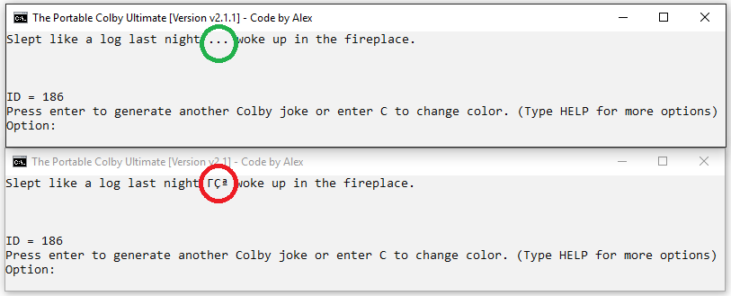

## The Portable Colby Ultamite
A Colby-joke generator that comes with computer help.
# [**Download the latest version**](https://github.com/AI199864/The-Portable-Colby/raw/master/Portable%20Colby%20Ultimate%20%5BVersion%202.1.1%5D%20.exe)
---------------------------------------------------------
### [See whats new!](https://github.com/AI199864/The-Portable-Colby/blob/master/README.md#current-version)

##### The Portable Colby™ is a Colby-joke generator and a computer helper.

The Portable Colby has now been updated to **version 2.1** with well over 2x as much code!
Now with 60,044 characters and 2,608 lines of code!

---------------------------------------------------------
# Current Version:
## [Update 2.1.1](https://github.com/AI199864/The-Portable-Colby/raw/master/Portable%20Colby%20Ultimate%20%5BVersion%202.1.1%5D%20.exe)
##### (If you see any bugs/glitches or have a suggestion, please let me know so I can fix it in the next update.)  

## What's new:
- Fixed Unicode Error

---------------------------------------------------------  
---------------------------------------------------------  

# Previous Verions:

## [Update 2.1](https://github.com/AI199864/The-Portable-Colby/raw/master/Portable%20Colby%20Ultamite%20%5BVersion%202.1%5D%20.exe)

## What's new:
- 124 new jokes!
- Fixed glitch where Chrome flags the file as 'dangerous'.

## [Update 2.0](https://github.com/AI199864/The-Portable-Colby/raw/master/Portable%20Colby%20Ultimate%20%5BVersion%202.0%5D%20.exe)

#### If you are downloading this version through Chrome, click the arrow on the right and click "Keep".

###### (Or download it through Internet Explorer)

## What's new:
- Color configurations now save after you close out.
- Improved command system.
- Added a new help screen that lists and describes each new option.
- New spaced out look.
- Added a new Joke ID system. Joke ID's are displayed on the jokes screen. You can now go to any joke by typing its ID.
- New implemented option fixes the Google Chrome invisible cursor glitch.
- New implemented option refreshes Windows (fixes most Windows 10 glitches).
#### And much more!
